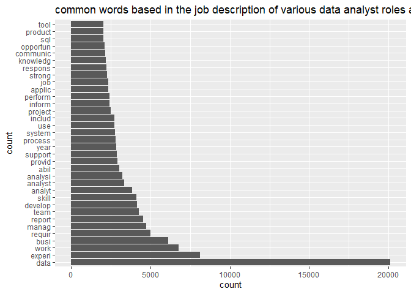

Data\_analyst
================


``` r
dataAnalyst <- read.csv("~/Desktop/DataAnalyst.csv", comment.char="#")

library(DataExplorer)
library(ggplot2)
library(tidyr)
library(dplyr)
library(stringr)
library(quanteda)
library(wordcloud)
dataAnalyst[1]<-NULL
dataAnalyst$Job.Title<-tolower(dataAnalyst$Job.Title)
data<-dataAnalyst
```

``` r
introduce(data)
```

    ##    rows columns discrete_columns continuous_columns all_missing_columns
    ## 1 10807      15               15                  0                   0
    ##   total_missing_values complete_rows total_observations memory_usage
    ## 1                    0         10807             162105      8752824

There is a lot of missing values present.^

``` r
plot_missing(data)
```

<!-- -->

all the features have more than 50% of missing values.^

``` r
data$Competitors<-NULL
data$Easy.Apply<-NULL
data%>%select(Job.Title)%>%group_by(Job.Title)%>%summarise(total=n())%>%arrange(desc(total))%>%top_n(20)
```

    ## `summarise()` ungrouping output (override with `.groups` argument)

    ## Selecting by total

    ## # A tibble: 21 x 2
    ##    Job.Title               total
    ##    <chr>                   <int>
    ##  1 ""                       5482
    ##  2 "data analyst"            335
    ##  3 "senior data analyst"      78
    ##  4 " color"                   42
    ##  5 "junior data analyst"      28
    ##  6 " analyze"                 27
    ##  7 "business data analyst"    23
    ##  8 " tx"                      22
    ##  9 " tx,dallas"               19
    ## 10 "sr. data analyst"         17
    ## # ... with 11 more rows

Top 10 most common data analyst job listed.^

Cleaning the salary value.

``` r
data<-data%>%separate(Salary.Estimate,c("salary","col2"),sep=" ")
data$col2<-NULL

data1<-data%>%separate(salary,c("col1","col2"),sep="-")
data1$col1<-substr(data1$col1,2,6)
data1$col1<-gsub("K","",data1$col1)
data1$col1<-as.numeric(data1$col1)
names(data1)[2]<-"min"


data1$col2<-substr(data1$col2,2,6)
data1$col2<-gsub("K","",data1$col2)
data1$col2<-as.numeric(data1$col2)
names(data1)[3]<-"max"

avg<-function(x,y){
  (x+y)/2
}

data1$mean<-avg(data1$min,data1$max)

data%>%select(salary)%>%group_by(salary)%>%summarise(total=n())%>%arrange(desc(total))
```

    ## # A tibble: 86 x 2
    ##    salary      total
    ##    <chr>       <int>
    ##  1 ""           8915
    ##  2 "$41K-$78K"    57
    ##  3 "$42K-$76K"    57
    ##  4 "$50K-$86K"    41
    ##  5 "$35K-$67K"    33
    ##  6 "$43K-$76K"    31
    ##  7 "$58K-$93K"    31
    ##  8 "$27K-$52K"    30
    ##  9 "$35K-$42K"    30
    ## 10 "$37K-$66K"    30
    ## # ... with 76 more rows

Estimated salary for a data analyst roles.^

``` r
data1$Rating<-as.numeric(data1$Rating)
data2<-subset(data1,Rating<10)
rate<-subset(data2,Rating!=-1)
plot(rate$Rating,rate$mean)
```

<!-- -->

we dont see any realationship between salaries and comapnies ratings

using pearsons correlation to check

``` r
cor.test(rate$Rating,rate$mean)
```

    ## 
    ##  Pearson's product-moment correlation
    ## 
    ## data:  rate$Rating and rate$mean
    ## t = 0.41755, df = 1646, p-value = 0.6763
    ## alternative hypothesis: true correlation is not equal to 0
    ## 95 percent confidence interval:
    ##  -0.03801418  0.05854895
    ## sample estimates:
    ##        cor 
    ## 0.01029138

Since the p value is greater than 0.05 we cannot reject our null
hypothesis, therefore there is no relation.

Top 10 comapnies with the most data analytical roles listed:

``` r
data2%>%select(Company.Name,Rating)%>%group_by(Company.Name,Rating)%>%summarise(total=n())%>%arrange(desc(total))
```

    ## `summarise()` regrouping output by 'Company.Name' (override with `.groups` argument)

    ## # A tibble: 1,304 x 3
    ## # Groups:   Company.Name [1,304]
    ##    Company.Name                            Rating total
    ##    <chr>                                    <dbl> <int>
    ##  1 "Staffigo Technical Services, LLC\n5.0"    5      50
    ##  2 "Diverse Lynx\n3.9"                        3.9    18
    ##  3 "Lorven Technologies Inc\n4.0"             4      14
    ##  4 "Robert Half\n3.5"                         3.5    13
    ##  5 "Avacend, Inc.\n2.5"                       2.5    12
    ##  6 "Kforce\n4.1"                              4.1    12
    ##  7 "Mondo\n3.9"                               3.9    10
    ##  8 "Reliable Software Resources\n4.0"         4       9
    ##  9 "Apex Systems\n3.8"                        3.8     7
    ## 10 "eTeam Inc.\n3.7"                          3.7     7
    ## # ... with 1,294 more rows

details of the top 5 companies:

``` r
staffigo_technical_services<-View(subset(data2,Company.Name=="Staffigo Technical Services, LLC\n5.0"))
diverse_lynx<-View(subset(data2,Company.Name=="Diverse Lynx\n3.9"))
lorven_technologies<-View(subset(data2,Company.Name=="Lorven Technologies Inc\n4.0"))
robert_half<-View(subset(data2,Company.Name=="Robert Half\n3.5"))
avacend.inc<-View(subset(data2,Company.Name=="Avacend, Inc.\n2.5"))
```

Companies with the most employees:

``` r
employ<-subset(data2,Size=="10000+ employees")
employ%>%select(Company.Name,Rating)%>%group_by(Company.Name,Rating)%>%arrange(desc(Rating))
```

    ## # A tibble: 301 x 2
    ## # Groups:   Company.Name, Rating [162]
    ##    Company.Name                      Rating
    ##    <chr>                              <dbl>
    ##  1 "NVIDIA\n4.6"                        4.6
    ##  2 "Fortinet\n4.5"                      4.5
    ##  3 "Facebook\n4.5"                      4.5
    ##  4 "Google\n4.4"                        4.4
    ##  5 "Google\n4.4"                        4.4
    ##  6 "HCL Global Systems\n4.3"            4.3
    ##  7 "University of Florida\n4.3"         4.3
    ##  8 "University of Pennsylvania\n4.3"    4.3
    ##  9 "University of Pennsylvania\n4.3"    4.3
    ## 10 "University of Pennsylvania\n4.3"    4.3
    ## # ... with 291 more rows

we see that many newer enterprises are being data driven and hence at
lot more listing from them

``` r
data2$Founded<-as.numeric(data2$Founded)
data3<-subset(data2,Founded!=-1)
ggplot(data3,aes(Founded))+geom_histogram(bins = 30)+ggtitle("Year wise data role listing")+xlab("Founded")+ylab("count")
```

<!-- -->

We can see this role is mostly recurited by private and public firms.

``` r
data3%>%select(Type.of.ownership)%>%group_by(Type.of.ownership)%>%summarise(total=n())%>%arrange(desc(total))
```

    ## `summarise()` ungrouping output (override with `.groups` argument)

    ## # A tibble: 13 x 2
    ##    Type.of.ownership              total
    ##    <chr>                          <int>
    ##  1 Company - Private                774
    ##  2 Company - Public                 331
    ##  3 Nonprofit Organization            89
    ##  4 Subsidiary or Business Segment    59
    ##  5 College / University              24
    ##  6 Government                        21
    ##  7 Hospital                          13
    ##  8 Private Practice / Firm            8
    ##  9 School / School District           5
    ## 10 Contract                           4
    ## 11 Other Organization                 2
    ## 12 Unknown                            2
    ## 13 Self-employed                      1

we can we that the IT leads the job market for data analyst roles
followed by business services and finance.

``` r
data3%>%select(Sector)%>%group_by(Sector)%>%summarise(total=n())%>%arrange(desc(total))
```

    ## `summarise()` ungrouping output (override with `.groups` argument)

    ## # A tibble: 23 x 2
    ##    Sector                    total
    ##    <chr>                     <int>
    ##  1 Information Technology      397
    ##  2 Business Services           347
    ##  3 Finance                     138
    ##  4 Health Care                 119
    ##  5 Insurance                    42
    ##  6 Education                    37
    ##  7 Media                        33
    ##  8 Retail                       28
    ##  9 Biotech & Pharmaceuticals    26
    ## 10 Manufacturing                24
    ## # ... with 13 more rows

we can see that ratings have no relation with any of the features and
that the annual income does not depend on the size or the amount of
revenue earned by the company.

``` r
data2%>%select(Rating,Revenue,mean)%>%group_by(Revenue)%>%summarise(average=mean(Rating),mean=mean(mean))
```

    ## `summarise()` ungrouping output (override with `.groups` argument)

    ## # A tibble: 15 x 3
    ##    Revenue                            average  mean
    ##    <chr>                                <dbl> <dbl>
    ##  1 ""                                   -1     74  
    ##  2 "-1"                                 -1     72.2
    ##  3 "$1 to $2 billion (USD)"              3.76  71.2
    ##  4 "$1 to $5 million (USD)"              3.31  74.6
    ##  5 "$10 to $25 million (USD)"            3.73  68.5
    ##  6 "$10+ billion (USD)"                  3.62  69.9
    ##  7 "$100 to $500 million (USD)"          3.60  69.2
    ##  8 "$2 to $5 billion (USD)"              3.54  71.2
    ##  9 "$25 to $50 million (USD)"            3.69  NA  
    ## 10 "$5 to $10 billion (USD)"             3.44  72.7
    ## 11 "$5 to $10 million (USD)"             3.64  68.2
    ## 12 "$50 to $100 million (USD)"           4.10  67.8
    ## 13 "$500 million to $1 billion (USD)"    3.55  69.4
    ## 14 "Less than $1 million (USD)"          3.51  72.2
    ## 15 "Unknown / Non-Applicable"            3.00  72.8

``` r
data2%>%select(Rating,Size,mean)%>%group_by(Size)%>%summarise(average=mean(Rating),mean=mean(mean))
```

    ## `summarise()` ungrouping output (override with `.groups` argument)

    ## # A tibble: 10 x 3
    ##    Size                      average  mean
    ##    <chr>                       <dbl> <dbl>
    ##  1 ""                          -1     74  
    ##  2 "-1"                        -1     72.2
    ##  3 "1 to 50 employees"          2.98  72.4
    ##  4 "10000+ employees"           3.62  68.9
    ##  5 "1001 to 5000 employees"     3.49  71.7
    ##  6 "201 to 500 employees"       3.65  70.2
    ##  7 "5001 to 10000 employees"    3.60  72.3
    ##  8 "501 to 1000 employees"      3.62  71.3
    ##  9 "51 to 200 employees"        3.73  NA  
    ## 10 "Unknown"                    1.18  72.9

text analysis of the job description.

``` r
text<-tokens(data2$Job.Description,what="word",remove_punct = TRUE,remove_numbers = TRUE,remove_symbols = TRUE)

text<-tokens_tolower(text)
text<-tokens_select(text,stopwords(),selection = "remove")
text<-tokens_wordstem(text,language = "english")
text<-tokens_remove(text,"â")

text.dfm<-dfm(text)

freqr<-colSums(as.matrix(text.dfm))
ord<-order(freqr,decreasing = TRUE)

#most used words in the job description
freqr[head(ord,10)]
```

    ##    data  experi    work    busi  requir   manag  report    team develop   skill 
    ##   20110    8105    6758    6130    4997    4738    4540    4259    4154    4135

Visualizating the most common words.

``` r
visual<-data.frame(term=names(freqr),occurrences=freqr)

ggplot(subset(visual,freqr>2000),aes(x=reorder(term,-occurrences),y=occurrences))+geom_bar(stat="identity")+coord_flip()+xlab("count")+ylab("count")+ggtitle("common words based in the job description of various data analyst roles and companies")
```

<!-- -->

Visualizing using wordcloud.

``` r
wordcloud(names(freqr),freqr,min.freq =1000,colors = brewer.pal(6,"Dark2"))
```

<!-- -->

n-grams- including word ordering i.e joining the two successive words

``` r
text.n<-tokens_ngrams(text,2)
text.n<-tokens_replace(text.n,"data_analysi","data_analyst")
text.n<-tokens_replace(text.n,"data_analyt","data_analyst")
text.n<-tokens_replace(text.n,"data_qualiti","data_analyst")
text.n<-dfm(text.n)
n.freq<-colSums(as.matrix(text.n))
n.ord<-order(n.freq,decreasing = TRUE)

n.freq[head(n.ord,10)]
```

    ##   data_analyst    year_experi communic_skill     data_manag equal_opportun 
    ##           4469           1035            725            679            605 
    ##     skill_abil   job_descript    experi_data  comput_scienc    experi_work 
    ##            601            601            588            581            560

``` r
visual1<-data.frame(term=names(n.freq),occurrences=n.freq)

ggplot(subset(visual1,n.freq>300),aes(x=reorder(term,-occurrences),y=occurrences))+geom_bar(stat="identity")+coord_flip()+xlab("count")+ylab("count")+ggtitle("common 2 successive words based in the job description of various data analyst roles and companies")
```

<!-- -->

Visualizing using wordcloud.

``` r
wordcloud(names(n.freq),n.freq,min.freq =400,colors = brewer.pal(6,"Dark2"))
```

<!-- -->
